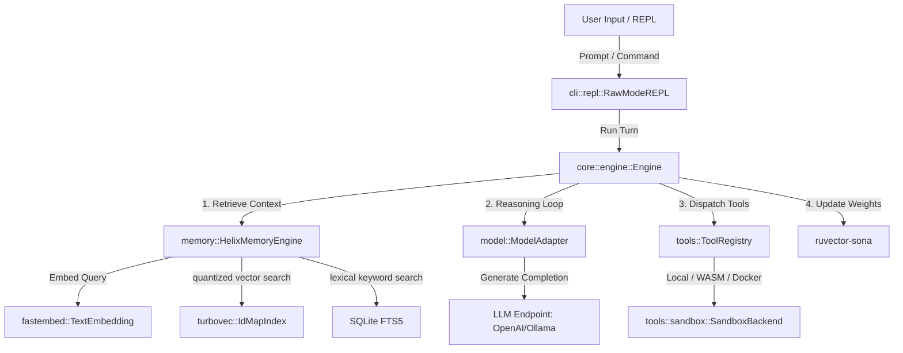

# Helix

A high-performance, tool-calling AI agent command-line interface built in Rust.  
Designed as a research-oriented tool-calling harness, Helix provides fine-grained control over agent execution loops, dynamic context window management, session tracing, and local codebase retrieval alignment.


> [!IMPORTANT]
> **Research-Grade Prototype & Security Disclaimer**
> Helix is an experimental, research-grade AI agent harness and library designed to evaluate memory alignment mechanisms, vector quantization algorithms, and sandboxed tool execution.
> *   **Production Notice**: This project is **not** audited or intended for production environments. 
> *   **Security Warning**: Running Helix with native local tool permissions allows the LLM to execute arbitrary code on your host machine. Always use the built-in **Docker** or **WebAssembly (Wasm)** sandbox backends to isolate execution environments.
---

## 🏛️ System Architecture



---

## ⚙️ Optimization & Adaptation Mechanisms

Helix implements a feedback loop to improve retrieval accuracy over time:

### Query Vector Projection Alignment (SONA)
*   **Availability**: Active in all environments.
*   **Mechanism**: On turn completion, the engine computes a trajectory quality score based on step metrics, tool errors, and healer retries. When quality is high, the SONA engine updates weights in a lightweight Low-Rank Adaptation (LoRA) projection layer to align the user's initial query vector closer to the centroid embedding of successfully retrieved workspace documents.
*   **Purpose**: Dynamically adjusts semantic memory query representations to prioritize relevant workspace files and context based on usage history.

---

## 🛠️ Key Capabilities

- **Quantized Semantic Memory Index**: Combines SQLite metadata with a 4-bit TurboQuant vector index (`turbovec`) and offline ONNX `BAAI/bge-small-en-v1.5` embeddings (`fastembed`). Baseline memory footprint is ~227 MiB RSS, scaling at ~3.2 MiB per 100k memories (see [docs/memory_architecture.md](docs/memory_architecture.md)).
- **Query Projection Tuning**: Applies gradient adjustments to the LoRA retrieval weights, aligning semantic searches to context that previously led to successful turns.
- **API & Local Model Agnostic**: Supports any OpenAI-compatible API provider (e.g., OpenAI, OpenRouter) and native Ollama endpoints. Swappable mid-session via `/use`.
- **Schema-Guided Healer**: Detects malformed JSON tool calls, classifies errors (e.g., missing parameters or invalid tool names), and provides the target schema to the model to prompt automatic self-correction.
- **Isolated & Secure Sandboxing**: Supports standard containers and sandboxed execution, with strict interactive confirmation prompts for local system tools.
- **Markdown Tool Parsing**: Extracts and resolves tool invocations embedded in markdown code blocks as a fallback for models lacking native tool-calling outputs.
- **Graceful Cancellation**: Uses `tokio::select!` to abort pending model requests and system tasks instantly on `Ctrl+C` without leaking background resources.
- **Active Skill Registry**: Dynamically scans, loads, and injects custom instruction files (`.md` or `.txt` containing guidelines or coding standards) from your data directory into the system prompt context, displaying loaded skills in connection banners and `/status` diagnostics (see [docs/skills.md](docs/skills.md)).
- **Terminal-Adaptive Box Layouts**: Automatically queries terminal widths to dynamically format, wrap, and pad chat logs cleanly without overflowing console boundaries.

---

## 🖥️ Terminal UI Design

Helix uses a two-tone boxed conversation layout:

| Box | Color scheme | Label |
|-----|-------------|-------|
| User input | Cool blue/cyan (adaptive, `blue()` border and header) | `You` |
| Agent response | Warm amber/gold (adaptive, `yellow()` border and header, markdown formatted) | `Helix` |

Both boxes use rounded Unicode rounded corners (`╭ ╮ ╰ ╯`) and display an `[Elapsed: X.XXs]` timer on the closing border.

**Post-response footnotes** (dimmed/adaptive, printed after the box closes):
```
  ◆ Memory: Found N relevant workspace memories (adapted via Micro-LoRA)
  · loop 1/20
  · [sona] quality 0.95
```

When tools are called mid-turn:
```
  ⦿ Tool: dispatching 1 → bash
  ✓ 'bash' completed (219 bytes)
```

The `· loop N/20` label shows which agent tool-use iteration is active. The max is 20 iterations per turn to prevent runaway loops.

For full color token definitions and box math, see [docs/ux_design.md](docs/ux_design.md).

---

## 📥 Quick Start & Installation

Install Helix CLI on your local machine with a single setup command:

### macOS & Linux:
```bash
curl -fsSL https://raw.githubusercontent.com/poornachandra24/Helix/main/install.sh | sh
```
*(Requires **GLIBC 2.35+**, i.e. Ubuntu 22.04+, Debian 12+. If your system has an older version of C libraries, run the **Docker** image instead).*

### Windows (PowerShell):
```powershell
irm https://raw.githubusercontent.com/poornachandra24/Helix/main/install.ps1 | iex
```

### Docker (Containerized):
To run containerized without local installation:
```bash
docker run -it --rm \
  --user "$(id -u):$(id -g)" \
  -v "$(pwd)":/workspace \
  -e HELIX_HOME=/workspace/.helix \
  ghcr.io/poornachandra24/helix:latest
```

*For alternative install methods (Cargo, manual build) and configuration steps, see the dedicated [Installation & Setup Guide](docs/installation.md).*

---

## 🛠️ Local Development & Building

If you are developing Helix locally:

### Building
```bash
cargo build --release
```

### Running
```bash
cargo run
# With verbose logging
cargo run -- -v
cargo run -- -vv
```

---

## 💬 REPL Commands

### Core Commands & Session Control

| Command | Description |
|---------|-------------|
| `/help` | Show this command guide |
| `/status` | Show active model, context budget, SONA & optimization stats |
| `/clear` | Reset current chat history context |
| `/config` | Reconfigure active provider / model |
| `/providers` | List configured API providers |
| `/use <name> [model]` | Hot-switch provider/model in the current session |
| `/sessions` | List previous chat sessions |
| `/resume <id>` | Load a past session into the active context |
| `/memory [query]` | Search/manage semantic memory (`--clear` to wipe) |
| `/exit` \| `/quit` | Exit the REPL session |

---

## 🔌 Model Context Protocol (INPUT)

Helix natively supports external tool servers conforming to MCP over `stdio` transport. Specify servers in `mcp_config.json` in the current directory or config directory, and Helix will spawn, initialize, and register their tool schemas on boot.

See [docs/mcp_integration.md](docs/mcp_integration.md) for details.

---

## 📖 Documentation

| Document | Contents |
|----------|----------|
| [docs/installation.md](docs/installation.md) | Dedicated Installation, setup wizard, Docker & config guide |
| [docs/memory_architecture.md](docs/memory_architecture.md) | Dual-store memory design, data flow, footprint profiles |
| [docs/mcp_integration.md](docs/mcp_integration.md) | MCP client subsystem, process lifecycle, config |
| [docs/ux_design.md](docs/ux_design.md) | Terminal UI system, color tokens, box math, telemetry format |
| [docs/skills.md](docs/skills.md) | Custom instruction files scanning and prompt injection |

---

## 🏷️ Citation

If you use Helix in your research, academic publications, or technical reports, please cite the project as follows:

```bibtex
@software{helix_agent_2026,
  author = {Poornachandra},
  title = {Helix: A Self-Optimizing Autonomous AI Agent Harness and Library in Rust},
  year = {2026},
  publisher = {GitHub},
  journal = {GitHub Repository},
  howpublished = {\url{https://github.com/poornachandra24/Helix}}
}
```
