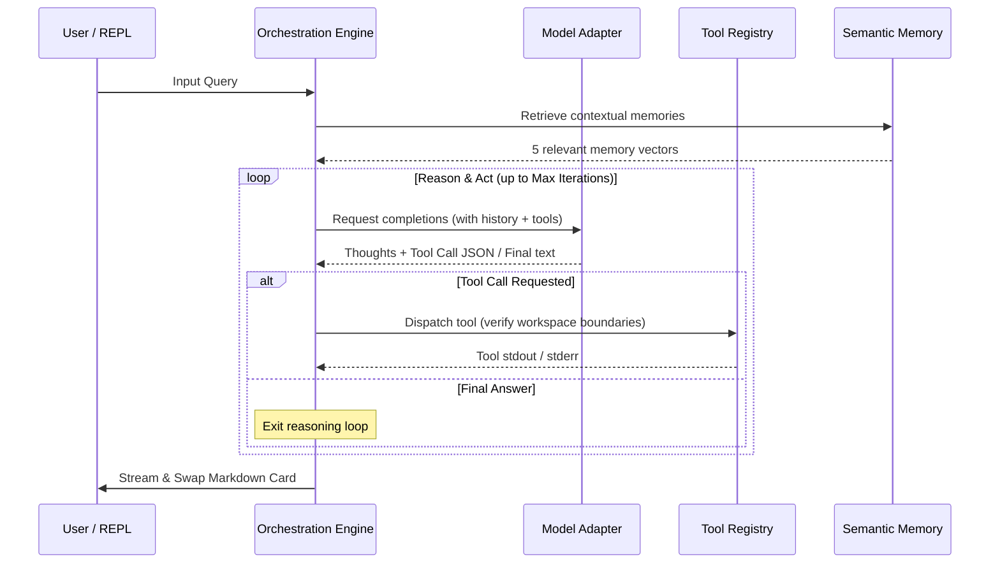

# Helix Architecture Overview

This document provides a comprehensive technical breakdown of the Helix core runtime architecture, detailing engine orchestration, token-based context budgeting, persistent sandboxed execution, and the adaptive memory learning system.

---

## 1. Core Orchestration Engine (`engine.rs`)

The `Engine` struct orchestrates the autonomous agent reasoning-action trajectory loop. Rather than a simple prompt-response flow, Helix executes a stateful multi-step loop:



### Self-Healing Parser
If the LLM outputs malformed tool call JSON, the `Engine` captures the parsing error, executes `classify_and_diagnose_parse_error`, and automatically sends a correction prompt to the model (up to 3 retries) before failing, ensuring high agent reliability.

### Self-Correction & Reflection Strategy
To handle complex and error-prone multi-step tasks, Helix incorporates an autonomous Self-Correction & Planning Loop coupled with a Dynamic Workspace Scratchpad:
1.  **Complexity Classification**: Upon receiving a query, Helix classifies its complexity. Simple queries bypass the scratchpad and reflection loop entirely for a lightweight footprint, while complex queries activate them.
2.  **Dynamic Scratchpad (`.helix_scratchpad.md`)**: A local markdown scratchpad is created on-the-fly when complex reasoning begins. The contents of the scratchpad are read at the start of each step and dynamically injected into the model's system prompt to maintain state and context grounding.
3.  **Self-Correction Loop**: When a tool execution fails or returns an error, the engine pauses and executes an internal reflection turn. The model is prompted to evaluate:
    *   **Current State**: What is the current progress and what exactly failed?
    *   **Target State**: What is the final target condition to achieve the user's goal?
    *   **Strategy to Close Gap**: How does the proposed plan adjust to overcome the error and close the gap between the current state and target state?
4.  **Telemetry Trace**: The structured reflection is written back to the scratchpad to guide the next iteration, and streamed live to the user interface (under a `▼ Thinking Process` header) for real-time visibility into the agent's reasoning.

---

## 2. Context Window Manager (`context.rs`)

Helix manages exact token-budget allocations dynamically to prevent API payload overflows (`400 Bad Request`).

*   **Exact Token Estimation**: Utilizes `tiktoken-rs` to count tokens exactly for the system prompt, tool descriptors, and active chat history.
*   **Response Headroom**: Allocates dedicated buffer headroom (e.g., 4,096 tokens) to guarantee the model has enough output space to complete reasoning chains.
*   **Dynamic Compaction**: When the total consumed tokens exceed the budget threshold, the `ContextManager` automatically compacts history by summarizing the oldest chat turns and compressing them, freeing up space without losing historical context.

---

## 3. Persistent Sandboxing (`sandbox.rs`)

To securely execute code generated by the model, Helix implements three sandbox backends managed through the `SandboxBackend` trait:

```
                  ┌─────────────────┐
                  │ SandboxBackend  │
                  └────────┬────────┘
                           │
         ┌─────────────────┼─────────────────┐
         ▼                 ▼                 ▼
  ┌─────────────┐   ┌─────────────┐   ┌─────────────┐
  │ Local Mode  │   │ Docker Mode │   │ Wasm Mode   │
  └─────────────┘   ┌─────────────┐   └─────────────┘
                    │ Stateful Daemon
                    │ Cpu/Mem Limits
                    │ Path Validations
```

### 3.1 Stateful Docker Sandbox
*   **Persistent Container Daemon**: Launches a single background container (`rust:latest`) mapped to a unique workspace hash on session start. Commands are executed using `docker exec -w <dir>` to preserve directory structure, environment variables, and package installations.
*   **Resource Constraints**: Constrains execution to `--memory 512m` and `--cpus 1.0` to guard against host resource exhaustion.
*   **User Mapping**: Runs operations as the host's UID/GID to avoid producing files owned by root on the host machine.

### 3.2 Workspace Path Traversal Protection
All file-system tools (`read_file`, `write_file`, `list_dir`) route paths through the `resolve_and_validate_path` safety check:
1.  Target paths are joined to the workspace root.
2.  Components are normalized (resolving `..` paths to block parent-directory escapes).
3.  Both the workspace base and target paths are canonicalized (resolving symlinks).
4.  Verifies the canonical target path strictly starts with the canonical workspace root, returning `Access Denied` on any violation.

---

## 4. Adaptive Memory & SONA

Helix integrates a dual-store semantic memory model with localized query alignment:

*   **Vector Engine (`turbovec`)**: Combined SQLite database (for metadata) and a 4-bit TurboQuant quantized vector index to store long-term memories.
*   **SONA Self-Optimization**:
    *   Tunes queries on the fly utilizing an embedding projection matrix (Micro-LoRA rank 8 alignment).
    *   Uses **Elastic Weight Consolidation (EWC)** to consolidate task parameters without catastrophic forgetting.
    *   Applies **L2 Regularization** (configured via `ewc_lambda`) to ensure weights stay within safe mathematical bounds.
