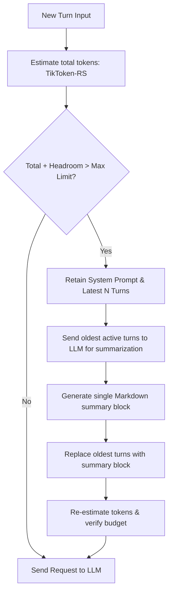

# Context Window Engineering & Management

In Helix, the **Context Window is the ultimate ground truth**. Regardless of the complexity of vector databases, lexical search indices, local file systems, or external MCP servers, the intelligence and accuracy of the model are entirely dictated by the exact contents of the LLM context window at the moment of the API call. 

Harnessing this requires rigorous context engineering: optimizing token budgets, dynamically registering tools, and compacting conversation histories to maximize reasoning quality while preventing budget overflow.

---

## 1. Tool Registration vs. Context Window Presence

A key distinction in Helix's architecture is the difference between tool registration and its active presence in the context window:

*   **Tool Registration**: When Helix starts or hot-reloads `mcp_config.json`, the native tools and external MCP tools are discovered, parsed, and loaded into the memory-bound `ToolRegistry`. At this stage, the tools are *registered* but do not yet consume any LLM token budget. They are passively available for execution.
*   **Context Window Presence**: During a reasoning step, Helix serializes the active tools from the registry into JSON Schema definitions (OpenAI tool call format) and injects them into the `tools` array of the Chat Completion request. Once serialized, they are *within the context window*. Because every tool schema consumes valuable token budget, Helix only injects tools that are registered and allowed, preventing unnecessary context bloat.

---

## 2. Context Window Allocation

The context window is segmented into distinct allocations to balance instructions, schemas, history, and generation headroom:

```
+-----------------------------------------------------------+
| System Prompt (Grounding & Core Instructions)             |
+-----------------------------------------------------------+
| Active Tool Schemas (Serialized JSON from ToolRegistry)   |
+-----------------------------------------------------------+
| Compaction Summary (Consolidated history of older turns)   |
+-----------------------------------------------------------+
| Sliding Window History (Latest chat turns verbatim)       |
+-----------------------------------------------------------+
| Dynamic Scratchpad (Grounding plan from scratchpad file)  |
+-----------------------------------------------------------+
| Response Headroom (Reserved output token budget)          |
+-----------------------------------------------------------+
```

---

## 3. Dynamic Context Compaction & Management

To prevent payload overflows (`400 Bad Request`) while preserving critical long-term context, `src/core/context.rs` executes a continuous context compaction cycle:



### 3.1 Token Estimation
Helix uses `tiktoken-rs` to count the exact token consumption of:
1.  The base system prompt.
2.  All serialized tool schemas.
3.  The active conversation history (system messages, user inputs, assistant outputs, tool results).

### 3.2 Response Headroom
To ensure the LLM has sufficient output generation slots to complete its chain-of-thought planning and tool calls, Helix reserves a dedicated block of tokens (typically 4,096 tokens) as **Response Headroom**. The active context window size is calculated as:
$$\text{Active Context Window} = \text{Max Model Tokens} - \text{Response Headroom}$$

### 3.3 The Compaction Algorithm
When the total calculated tokens exceed the active context window limit:
1.  **Retention Pinning**: Helix pins the core system prompt, active tool schemas, and the latest turns (e.g., the last 3-4 turns) to keep the immediate conversational context intact.
2.  **Summarization Consolidation**: The older conversational turns are sent to a fast summary prompt. The LLM condenses their goals, outcomes, and code results into a single Markdown-formatted summary.
3.  **Substitution**: The original verbose messages are removed from the history stack and replaced with a single assistant message containing the summary. This frees up significant token space while preserving the high-level history for downstream tasks.
