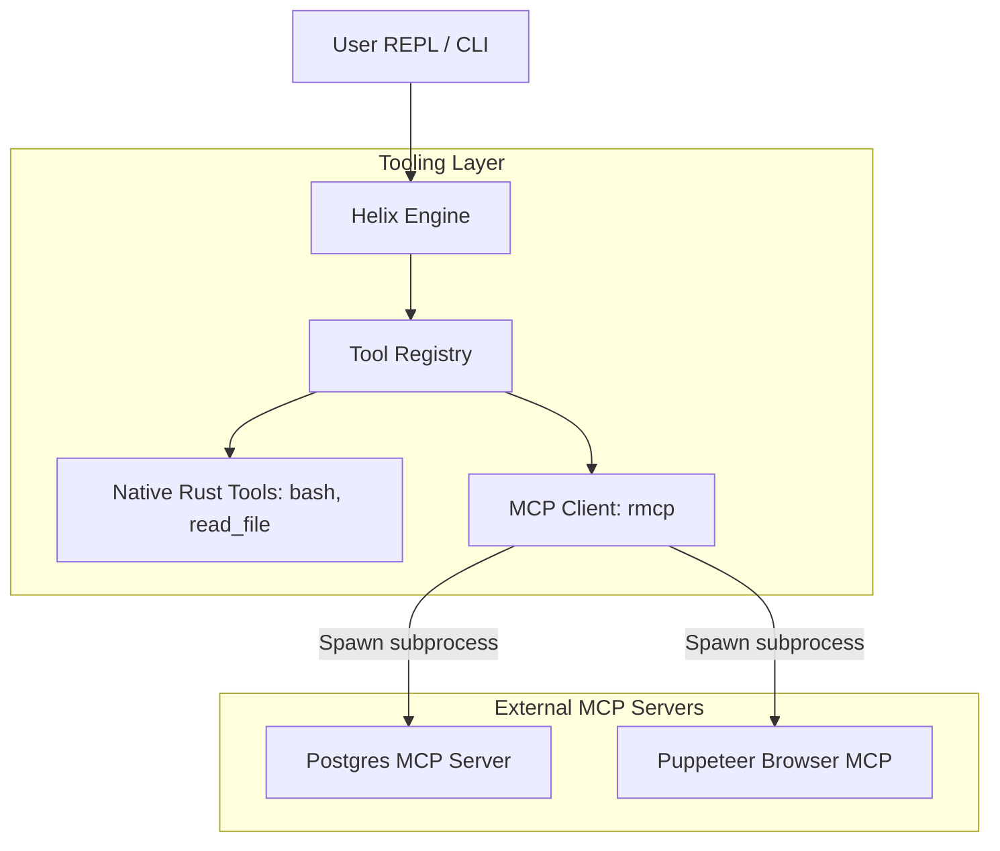
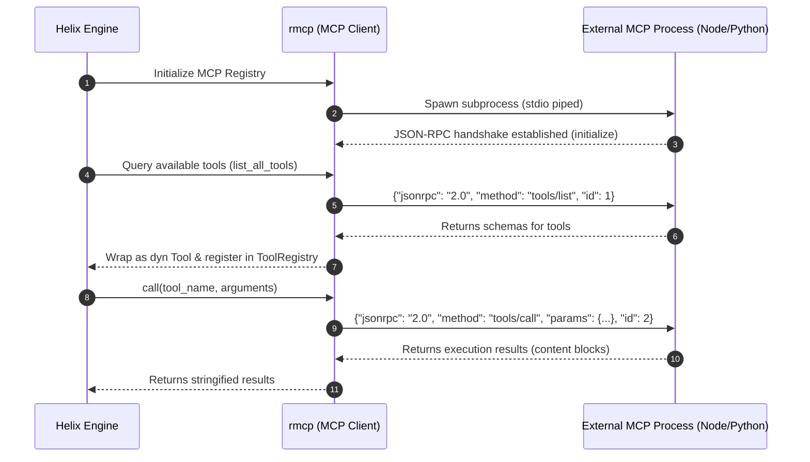

# Model Context Protocol (MCP) Integration

Helix supports dynamic tool registration through the **Model Context Protocol (MCP)**. This allows the engine to load external tools (e.g., databases, browser controllers, search engines) at runtime without compiling new Rust code.

---

## Architecture & Data Flow



---

## Execution Flow

When Helix starts up, it reads `mcp_config.json`. The handshake, tools discovery, and execution follow this sequence:



---

## Dynamic Registration vs. Context Window Injection

Understanding how tools flow from an external MCP server into the LLM context window is critical for managing performance and token budgets:

1.  **Handshake & Discovery (Dynamic Registration)**:
    -   On startup or configuration hot-reload, Helix reads `mcp_config.json`, spawns the listed server processes (via `stdio` piping), and performs the initialization handshake.
    -   Helix sends a `tools/list` request to each server.
    -   The server returns the JSON Schema definitions for all available tools.
    -   Helix wraps these definitions in a dynamic Rust `dyn Tool` interface and stores them in the memory-bound `ToolRegistry`. At this stage, the tools are **registered** but do not consume any model context space.
2.  **Context Window Injection**:
    -   When a prompt turn starts, Helix dynamically fetches the allowed tools from the `ToolRegistry`.
    -   Helix serializes the parameters and descriptions of these tools into the standard JSON schemas expected by the LLM (under the `tools` payload argument).
    -   Once injected, these schemas occupy actual slots inside the active **LLM Context Window**.
3.  **The Critical Distinction**:
    -   **Registered Tools**: Sit passively in memory and run as local subprocesses. They have a zero-token footprint on the LLM.
    -   **Context-Injected Tools**: Actively consumed by the LLM during inference. They directly exhaust the model's token limit. Therefore, optimizing tool descriptions and schema sizing is a critical task in Context Window Engineering.

---

## Configuration

Helix looks for an `mcp_config.json` configuration file in the following order of precedence:
1.  **Current Directory**: `./mcp_config.json`
2.  **Global Config Directory**: `<config_dir>/harness-cli/mcp_config.json`

### Example `mcp_config.json`

```json
{
  "mcpServers": {
    "postgres": {
      "command": "npx",
      "args": ["-y", "@modelcontextprotocol/server-postgres", "postgresql://localhost:5432/helix_db"],
      "requiresConfirmation": true
    },
    "puppeteer": {
      "command": "npx",
      "args": ["-y", "@modelcontextprotocol/server-puppeteer"]
    }
  }
}
```

### Configuration Fields
*   `command`: The executable to run (e.g., `npx`, `python3`, `node`).
*   `args`: Array of command-line arguments.
*   `env`: Optional map of environment variables to pass to the process.
*   `requiresConfirmation`: Optional boolean. If set to `true`, Helix will prompt the operator for confirmation before dispatching any tool from this server.

---

## Dynamic Configuration Hot-Reloading

To prevent developers from having to restart active sessions when adding new capabilities, Helix supports zero-downtime hot-reloading for MCP configurations:

1.  **File Integrity Monitor**: The core engine starts an asynchronous file watcher monitoring `mcp_config.json` (and user-defined skill directories).
2.  **State Synchronizer**: When write updates are detected, Helix parses the new JSON config structure:
    - **Added Servers**: Instantly initializes and handshakes with the new child processes.
    - **Modified/Removed Servers**: Sends a termination signal (`SIGTERM` / `kill`) to obsolete processes, cleans up internal registry references, and boots replacement instances.
    - **Registry Re-indexing**: Refreshes tool routing structures in real-time, making new tools immediately visible to the LLM system prompt on the next prompt turn.

