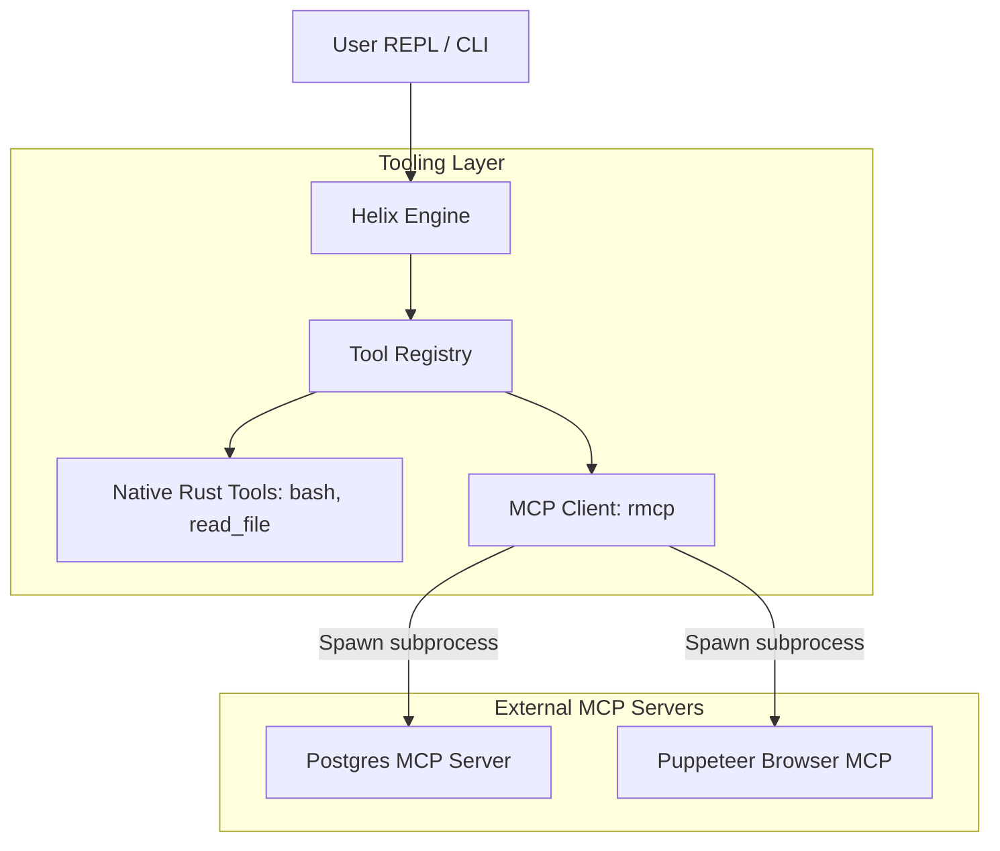
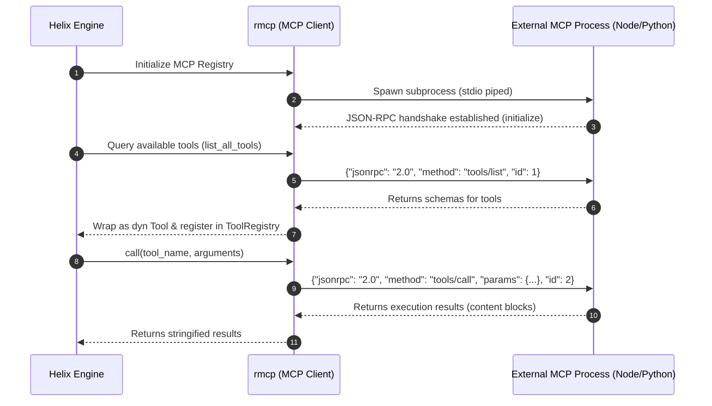

# Model Context Protocol (MCP) Integration

Helix supports dynamic tool registration through the **Model Context Protocol (MCP)**. This allows the engine to load external tools (e.g., databases, browser controllers, search engines) at runtime without compiling new Rust code.

---

## Architecture & Data Flow



---

## Execution Flow

When Helix starts up, it reads `mcp_config.json`. The handshake, tools discovery, and execution follow this sequence:



---

## Configuration

Helix looks for an `mcp_config.json` configuration file in the following order of precedence:
1.  **Current Directory**: `./mcp_config.json`
2.  **Global Config Directory**: `<config_dir>/harness-cli/mcp_config.json`

### Example `mcp_config.json`

```json
{
  "mcpServers": {
    "postgres": {
      "command": "npx",
      "args": ["-y", "@modelcontextprotocol/server-postgres", "postgresql://localhost:5432/helix_db"],
      "requiresConfirmation": true
    },
    "puppeteer": {
      "command": "npx",
      "args": ["-y", "@modelcontextprotocol/server-puppeteer"]
    }
  }
}
```

### Configuration Fields
*   `command`: The executable to run (e.g., `npx`, `python3`, `node`).
*   `args`: Array of command-line arguments.
*   `env`: Optional map of environment variables to pass to the process.
*   `requiresConfirmation`: Optional boolean. If set to `true`, Helix will prompt the operator for confirmation before dispatching any tool from this server.
