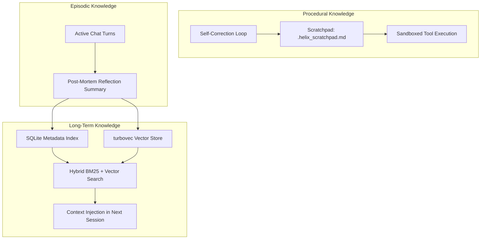
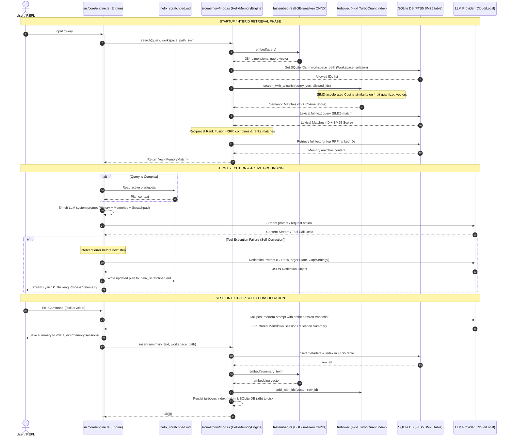
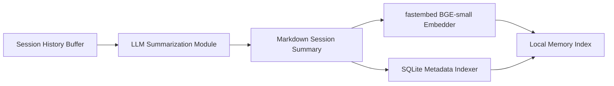

# Local Semantic Memory Architecture

Helix implements an offline, high-performance semantic memory store to persist and retrieve relevant past workspace interactions. This allows the agent to maintain context across sessions without bloating the active LLM context window.

---

## 1. Subsystem Components

*   **SQLite Metadata Store & FTS5 BM25 Search**: A local SQL database (`memory_meta.db`) that stores text snippets, associated files, and workspace directories. Uses SQLite's FTS5 extension to perform full-text BM25 search alongside vector queries.
*   **turbovec Quantized Index**: A high-performance vector index (`memory_index.tvim`) utilizing **4-bit TurboQuant Vector Quantization** for up to 16x memory compression. Vectors are matched using SIMD-accelerated cosine similarity.
*   **fastembed-rs ONNX Embeddings**: Automatically loads and caches the `BAAI/bge-small-en-v1.5` text embedding model (384 dimensions) completely offline using ONNX Runtime.
*   **BM25 Hybrid Retrieval**: Combines semantic embeddings with lexical FTS5 queries using Reciprocal Rank Fusion (RRF) to retrieve highly relevant context matches.
*   **Post-Mortem Reflective Memory**: Automatically summarizes and index-serializes the user-agent interaction session upon exit, feeding into long-term recall cache.
*   **Workspace Filtering & Allowlist**: To isolate workspaces, queries are filtered by mapping workspace row IDs from SQLite directly into `turbovec`'s search allowlist. This prevents memory leakage between projects.

---

## 2. Helix Knowledge Framework: Procedural, Episodic, and Long-Term Knowledge

Helix structures its intelligence and grounding layers around three distinct forms of knowledge representation:



### 2.1 Procedural Knowledge (Execution & Correction)
Procedural knowledge governs *how* the agent interacts with the workspace and rectifies execution errors in real-time.
*   **Self-Correction & Planning**: Driven by the intermediate planning and correction loop in `engine.rs`. When a tool execution fails, the engine analyzes the failure to determine the **Current State**, **Target State**, and the **Gap/Strategy** to resolve it.
*   **Dynamic Grounding**: This planning state is written to the local `.helix_scratchpad.md` workspace file, which is fed back into the LLM system prompt at each step. This keeps the agent's execution model grounded and prevents looping or repetitive errors during the turn.

### 2.2 Episodic Knowledge (Session Summarization)
Episodic knowledge captures the *history of interactions* as distinct episodes of work.
*   **Post-Mortem Session Reflection**: Rather than raw logging, when a REPL session ends (or `/clear` is called), Helix initiates an autonomous LLM turn to synthesize a structured Markdown summary of the entire session history.
*   **Structured Metadata**: The summary captures goals met, technical decisions made (e.g. implementation details), and outstanding issues to resolve next.

### 2.3 Long-Term Knowledge (Recall & Application)
Long-term knowledge provides *retrospective continuity* across multiple programming sessions.
*   **Vectorization & Indexing**: The episodic post-mortem summaries are saved as physical files under `<data_dir>/memory/sessions/` and indexed using `fastembed-rs` embeddings (384 dimensions) into the `turbovec` index and SQLite metadata database.
*   **Hybrid Context Retrieval**: When starting a subsequent session in the same workspace, Helix queries the long-term store using Reciprocal Rank Fusion (RRF) combining semantic vector queries with lexical BM25 search. The retrieved reflection summaries are injected directly into the LLM's system prompt, allowing the agent to inherit previous learnings, avoid repeating past troubleshooting steps, and build directly on top of past accomplishments.

---

## 3. Memory Subsystem Data Flow

The diagram below details the data flow during query search and turn-level storage:

```mermaid
graph TD
    subgraph Search Phase
        QueryInput[User Query] --> EmbedModel[fastembed: BAAI/bge-small-en-v1.5]
        EmbedModel --> QueryVec[Query Vector: 384 dimensions]
        
        Workspace[Active Workspace Path] --> SQLiteMeta[SQLite metadata]
        SQLiteMeta --> sqlite_ids[Find metadata IDs for workspace]
        sqlite_ids --> AllowlistCheck[Filter out non-indexed IDs]
        AllowlistCheck --> ActiveAllowlist[Active Allowlist]
        
        QueryVec & ActiveAllowlist --> SIMDSearch[turbovec: search_with_allowlist]
        SIMDSearch --> RawMatches[Top matches & scores]
        RawMatches --> QuerySQLite[Lookup matching text snippets in SQLite]
        QuerySQLite --> Matches[Return MemoryMatches]
    end

    subgraph Insertion Phase
        NewText[New Text Snippet] --> InsertSQLite[Insert metadata row in SQLite]
        InsertSQLite --> NewID[Retrieve generated row ID]
        NewText --> EmbedModelInsert[fastembed: BAAI/bge-small-en-v1.5]
        EmbedModelInsert --> Vector[384 float vector]
        Vector & NewID --> AddIndex[turbovec: add_with_ids]
        AddIndex --> Persist[Serialize index to .tvim]
    end
```



---

## 4. Temporal Sequence Diagram

This sequence diagram displays the step-by-step operations executed during a standard user interaction turn in the REPL:



---

## 5. Memory Footprint and Resource Verification

Helix is optimized to maintain a highly compact memory profile suitable for resource-constrained environments (such as a 256 MiB container limit).

### 📊 Resource Baseline and Scaling Profile

| Component | Approx. Memory (RSS) | Description / Impact |
|---|---|---|
| **Static Binary & Runtime** | ~5–9 MiB | Compiled release executable and mapped system libraries (`libc`, `libpthread`). |
| **ONNX Runtime Engine** | ~15–20 MiB | Shared libraries and thread-pool execution structures. |
| **FastEmbed (BGE-small-v1.5)** | ~45–50 MiB | ONNX weights mapped into physical memory. |
| **Active Runtime Engine (RSS)** | **~227 MiB** | Measured resident set size of the process on startup with 17 active threads. |
| **Quantized Index (turbovec)** | **~3.2 MiB** per 100k vectors | 4-bit quantization reduces 384-dim float vectors to just 24 bytes each. |
| **Metadata Cache (SQLite)** | **~0.5 MiB** per 100k rows | SQL database pages storing prompt snippets and workspace links. |

### 🔍 Thread Pool Scaling & RSS Explanation
Upon startup, Helix initializes **17 OS threads**. This is driven by ONNX Runtime (`ort` via `fastembed-rs`) configuring its parallel tensor execution pool to match the host machine's logical core count. 
While the raw model files on disk occupy only ~45–50 MiB, the total resident set size (VmRSS) baseline is ~227 MiB. This baseline includes:
1. ONNX pre-allocated tensor arenas.
2. Thread stacks (active pages).
3. Glibc memory allocation arenas.
4. Mapped shared object (.so) segments.

### 🛠️ Empirical Verification
To verify this memory footprint directly on a running Linux instance:

```bash
# Start Helix in the background, run status, and exit
(echo "/status"; sleep 5; echo "/exit") | ./target/release/helix &
PID=$!
sleep 1.5

# Check RSS, virtual size, and thread counts
cat /proc/$PID/status | grep -E "VmRSS|VmSize|VmPeak|Threads"
```

---

## 6. Lexical & Semantic Hybrid Search (BM25 + Vector)

To match exact technical vocabulary (such as function names, API keys, error codes, and config tags) that dense vector embeddings might dilute, Helix implements a hybrid retrieval model:

1.  **Lexical Query (BM25)**: An FTS5-backed virtual table index in SQLite performs full-text search. Term occurrences are scored using the Okapi BM25 algorithm.
2.  **Semantic Query (Cosine)**: Dense 384-dimensional vectors are evaluated in the `turbovec` index using SIMD-optimized cosine similarity.
3.  **Reciprocal Rank Fusion (RRF)**: Merges the ranked outputs of both search stages, ensuring items matching either exact keyword tokens or broad conceptual intent rise to the top.

---

## 7. Post-Mortem Reflective Memory

Upon termination of a REPL session (via `/exit` or normal interrupt), the harness triggers an autonomous compilation pipeline:



- **Summarization**: The engine passes the active session history to the LLM cloud/local engine, asking it to write a structured summary highlighting the goals achieved, technical decisions made, and outstanding issues.
- **Indexing**: The generated summary is written to `<data_dir>/memory/sessions/` and automatically embedded and indexed in SQLite and `turbovec`. Future sessions starting in the same workspace automatically inherit these key learnings.

