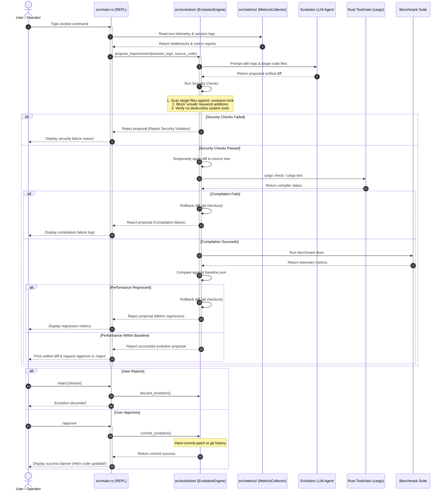

# Self-Evolution Loop and Security Gates

Helix features a secure, metrics-driven self-evolution loop. This subsystem allows the engine to analyze its execution telemetry, propose optimizations to its own Rust codebase, verify safety and regression gates, and apply updates upon human confirmation.

---

## 1. Safety Policies & Immutable Gates

To prevent recursive model degradation, security exploits, or system access escalation, Helix enforces a strict multi-tier security filter before compiling any proposed patch:

1.  **Immutable Lock (`.evolution-lock`)**: Certain core modules (such as `src/evolution/`, `src/metrics/`, or the evolutionary gates themselves) are locked. The model is physically blocked from proposing changes targeting these files.
2.  **Unsafe Operations Ban**: Any proposed patch containing the word `unsafe` or adding dangerous system API calls (such as spawning raw shells outside our confirmation gates) is instantly discarded.
3.  **Compilation Gate**: The engine executes `cargo check` and `cargo test` in a sandboxed target configuration. If compilation fails or compiler warnings are introduced, the patch is rejected.
4.  **No-Regression Gate**: The engine executes the headless Benchmark Suite (`benchmarks/`) and compares telemetry metrics (turn latency, token count, healer corrections, tool success rates) against `baseline.json`. If performance degrades, the engine automatically issues a `git revert` to roll back the changes.
5.  **Human Authorization Gate (or --auto-approve override)**: By default, Helix prompts the user for `/approve` or `/reject` to apply or discard the diff. However, if trust in the automated test gates is high, operators can bypass this manually using `/evolve --auto-approve` to let Helix self-apply changes immediately upon successful validation.

---

## 2. Evolution Subsystem Sequence Diagram

The sequence diagram below displays the self-evolution lifecycle from log analysis to codebase mutation:

